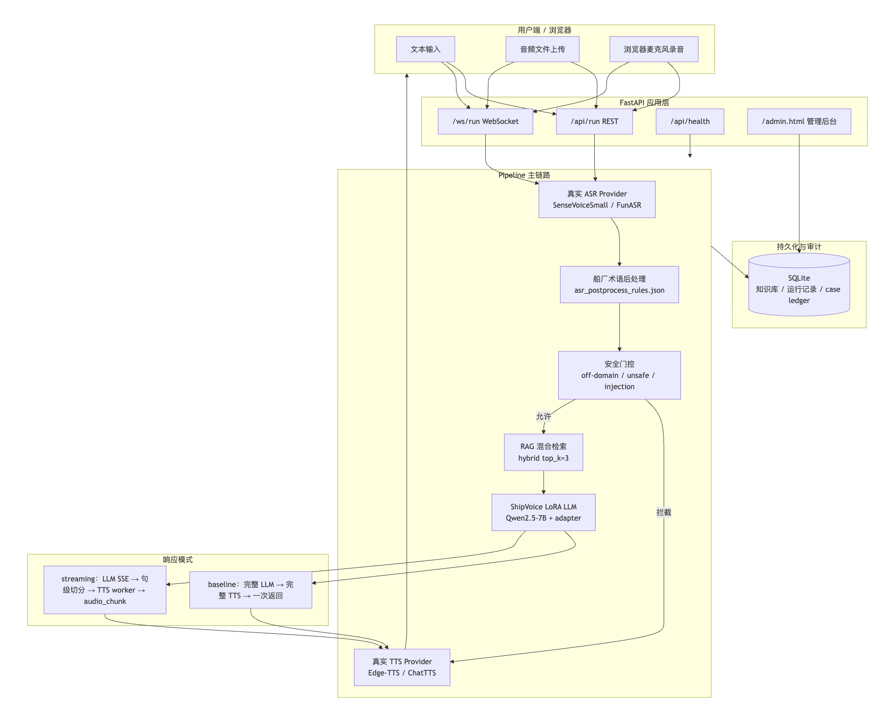
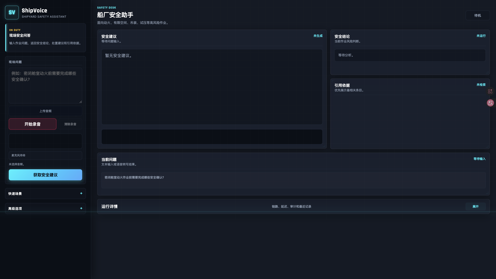
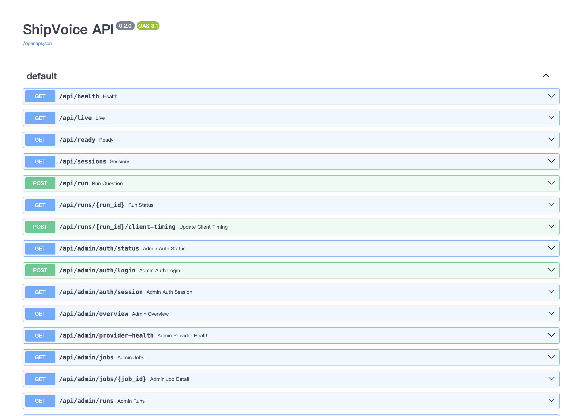
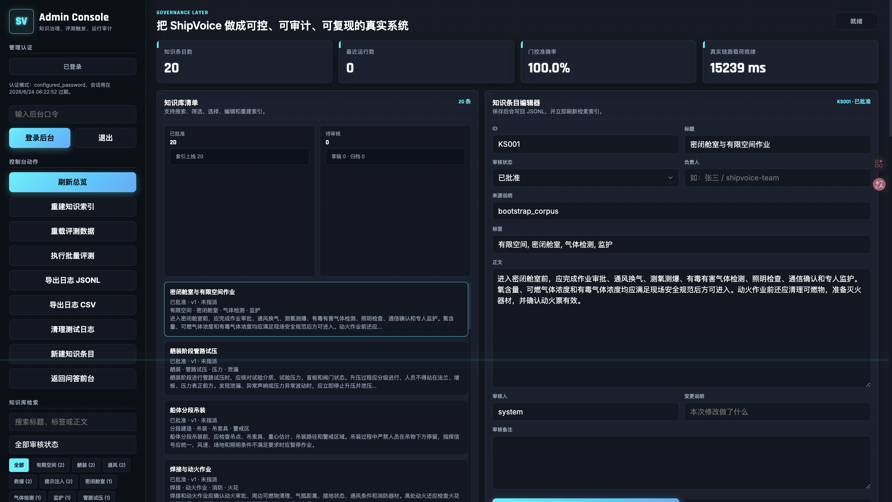
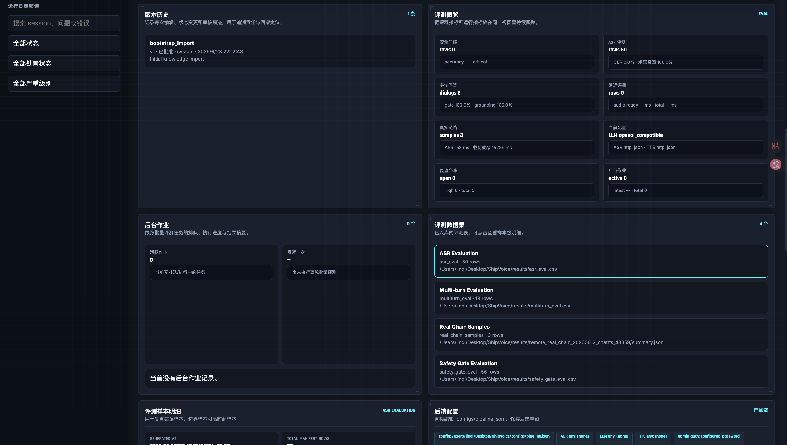
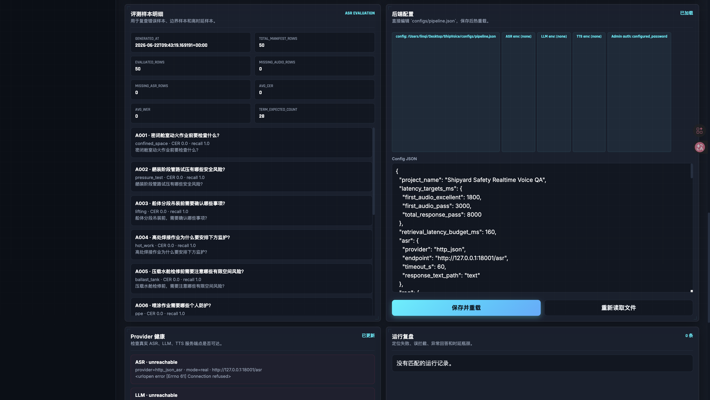
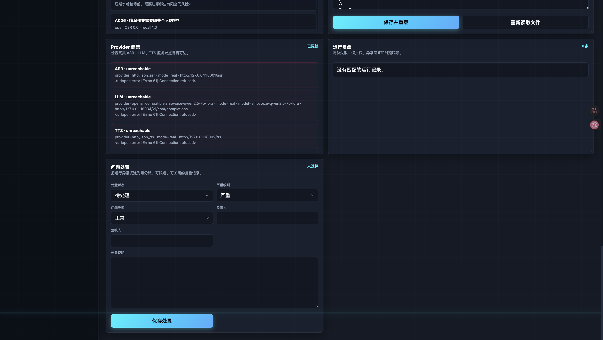

# ShipVoice 船厂安全实时语音问答助手项目报告

课程：信息安全基础  
选题：A2 级联式造船语音问答系统的复现与改进  
项目名称：ShipVoice 船厂安全实时语音问答助手  
小组成员：李星烁 许奕 肖相宇 张洛梧 林琪 金子涵 夏弘泰 

## 摘要

ShipVoice 是面向船厂高风险作业场景的实时安全语音问答系统。本项目依据课程 A2 要求，复现并扩展由自动语音识别（ASR）、语言模型（LLM）与语音合成（TTS）构成的级联式语音问答链路，在基础原型之上集成领域知识检索、证据引用、安全门控、运行审计与管理后台等模块，形成可运行、可测量、可复盘的完整应用。用户可通过文本输入、音频上传或浏览器录音提交问题；系统依次完成语音转写、船厂术语后处理、安全门控、检索增强生成（RAG）、语言模型推理与语音合成，输出附证据依据的安全建议，并支持语音播报。

本项目的主要改进体现在三个层面：其一，在级联链路中引入船厂安全领域约束，对越界、危险及提示注入类输入实施拦截，避免生成不合规内容；其二，建立 RAG 证据检索与引用展示机制，使回答与知识条目 ID、来源、风险等级、置信度及匹配词绑定，降低大模型幻觉风险；其三，构建可复现评测体系，对安全门控、ASR 术语识别、多轮问答、引用质量及真实语音链路进行量化评估，并在远程 GPU 环境完成 300 次仅依赖真实服务的重复实验。

实验结果表明，系统在安全门控、术语识别、多轮问答、引用质量及真实语音链路等方面均取得可复现的量化结果。安全门控评测集含 56 条样本，决策准确率 100%，误放行（false allow）为 0；50 条真实录音在线 ASR 评测不向 ASR 服务提供参考转写，平均字错误率/词错误率（CER/WER）为 1.58%，术语召回率 85.71%；多轮问答评测含 6 组对话共 18 轮，追问语境保持准确率（follow-up grounding accuracy）为 100%；引用质量评测中 title hit@3、ID hit@3 及答案引用 ID 覆盖率均为 100%。真实链路实验中，在门控放行（gate-allowed）配对样本上，流式改进相对串行基线平均缩短首段可播放延迟 4147.39 ms；浏览器端 audio.onplaying 观测 20 条样本全部播放成功，平均首播延迟 4093.5 ms。系统采用 real-only 运行策略：ASR、LLM、TTS 均接入真实服务提供方，任一环节不可用时请求失败并记录日志，不以静态示例替代真实运行结果。

## 1. 选题背景与需求分析

### 1.1 应用场景

船舶制造涵盖密闭舱室作业、动火作业、吊装作业、管路试压、高处作业、喷涂作业、临时用电等多种高风险场景。一线人员在作业现场遇到安全问题时，往往需要快速获取规范化处置建议；传统安全手册、制度文件与培训材料存在检索效率低、表述与现场语境脱节、难以支撑多轮追问等局限。语音问答系统可在该场景中发挥辅助作用：作业人员以口头方式提问，系统完成语音转写并返回结构化安全建议。

课程 A2 的核心要求是构建级联式语音问答系统，即 ASR 负责语音转写，语言模型负责理解与生成，TTS 负责语音播报；同时需围绕首段可播放延迟与主观等待体验开展可量化对比，并提交系统架构、模块版本与配置、基线与改进指标对比表、可复现实验步骤，以及改进点与局限说明。ShipVoice 在上述要求基础上进一步落实信息安全属性：系统不仅需回答操作层面的问题，更需判断问题本身是否应当被回答，并对危险请求与提示注入实施拦截。

### 1.2 项目定位

从工程与安全双重目标出发，船厂安全问答系统不宜设计为无边界通用聊天机器人。系统须对符合安全规范的问题给出有据可依的建议，对绕过审批、破坏报警装置、规避监护等越权或危险请求予以拒答，并对舾装阶段、压载水舱、测氧测爆、有限空间、动火作业等造船专有术语保持识别鲁棒性——ASR 误听将沿级联链路传递，可能导致检索偏移与回答失准。据此，本项目将低延迟优化、领域知识增强与安全控制列为同等优先级的设计目标。

ShipVoice 定位为可运行、可测量、可复盘的船厂安全语音问答系统原型，而非静态展示页面。系统满足 A2 对级联链路、延迟对比与实验复现的要求，并体现信息安全课程对输入安全、生成安全、证据安全与运维安全的关切。

### 1.3 典型用例

| 用户角色 | 典型场景 | 系统期望行为 |
|---|---|---|
| 舱室作业人员 | 询问有限空间作业前的安全检查事项 | ASR 转写 → 术语纠错 → 门控放行 → RAG 检索 → 返回带引用的安全建议并 TTS 播报 |
| 动火监护人员 | 追问气体异常出现后的后续处置步骤 | 结合多轮上下文（history），保持与前文一致的语境绑定 |
| 恶意或误操作输入 | 要求忽略安全规则并给出违规动火方法 | 安全门控短路拒答，不调用 LLM，不合成违规操作音频 |
| 系统维护人员 | 更新知识库、查阅运行记录、检查服务健康状态 | 通过管理后台完成知识治理、审计复盘与评测任务 |

## 2. 项目目标

本项目依据课程 A2 要求与船厂安全应用需求，确立以下五项建设目标。

（1）系统须具备真实可运行能力。前端支持文本提问、音频上传、浏览器录音、结果展示与 TTS 播放；后端提供标准 API、WebSocket 事件流、健康检查、运行审计与管理后台。

（2）系统须体现造船安全领域特征。知识库、评测集、术语表、拒答规则与示例问题均围绕船厂安全作业构建，不采用泛化开放域问答数据集。

（3）系统须具备明确的安全边界。对 off-domain、unsafe、prompt injection、boundary 等输入类别，须给出明确的放行或拒答决策，避免因大模型生成能力过强而输出不当内容。

（4）系统须建立量化实验体系。延迟优化须记录 ASR、检索、LLM、TTS、首段音频及总耗时等阶段指标；安全增强须通过测试集统计准确率、false allow、false block 等客观指标，而非定性描述。

（5）系统须支持实验复现。须提供明确的启动、测试、后台操作与实验复现步骤，并说明 ASR、LLM、TTS 端点配置及健康检查方法。

## 3. 总体系统设计

### 3.1 应用架构概览

ShipVoice 采用前后端一体的 FastAPI 应用架构。用户端提供现场问题输入、音频上传、浏览器录音与结果展示；后端执行问答主链路；管理后台承担知识库治理、运行记录管理、评测任务调度与 provider 健康检查。系统通过统一的真实 provider 抽象层接入 ASR、LLM、TTS，可对接 FunASR/SenseVoice、OpenAI-compatible Qwen/vLLM 服务及 HTTP TTS 服务。真实 provider 请求复用持久 HTTP client 连接池，避免高频问答和 LLM SSE 流式输出时反复建立短连接。

整体处理链路如下：

```text
文本/语音输入
  -> ASR 语音转写
  -> 船厂术语后处理
  -> 安全门控
  -> RAG 知识检索
  -> LLM 生成安全建议
  -> TTS 语音合成
  -> 前端展示与审计日志落库
```

安全门控位于 RAG 与 LLM 之前：当输入属于危险请求、无关话题或提示注入时，系统不调用语言模型生成详细操作步骤，而短路返回安全提示或拒答答复。RAG 检索位于语言模型之前，使回答依托本地知识库而非完全依赖模型参数记忆。TTS 置于链路末端，在输出语音结果的同时保留文本结果，供运行记录与事后复盘使用。

### 3.2 系统架构图

下图展示 ShipVoice 自用户输入至审计落库的完整数据流，含 baseline 与 streaming 两种响应模式分支。



架构设计要点如下：

1. Fail-closed 策略：相应链路需要调用的 ASR、LLM、TTS 真实服务不可用时，请求直接失败并写入审计日志，不返回虚假答案或虚假音频。
2. 门控前置：危险输入在 LLM 调用之前被拦截，避免先生成后过滤带来的合规风险。
3. 双模式延迟对比：同一 pipeline 支持 baseline（串行等待完整回答）与 streaming（安全闭合句段 TTS 首段优先），满足 A2 基线与改进方案的对比要求。
4. 双端延迟测量：服务端记录 first_audio_ready_ms，浏览器端记录 audio.onplaying，避免单一指标掩盖用户侧真实等待体验。

### 3.3 代码分层

| 层级 | 主要文件 | 作用 |
|---|---|---|
| 配置层 | `configs/pipeline.json`, `configs/runtime.*.env` | 定义 provider、延迟目标、术语表、拦截关键词、运行模式 |
| 数据模型层 | `src/shipvoice/models.py` | 定义问答事件、门控结果、检索结果、指标结构 |
| Provider 层 | `src/shipvoice/providers.py` | 封装真实 ASR、RAG、LLM、TTS provider；服务缺失时 fail-closed |
| Pipeline 层 | `src/shipvoice/pipeline.py` | 串接 ASR、后处理、门控、检索、生成和合成，输出运行事件与指标 |
| API 层 | `src/shipvoice/fastapi_app.py` | 提供用户端 API、WebSocket、后台 API、健康检查和评测任务接口 |
| 持久化层 | `src/shipvoice/sqlite_store.py` | 保存知识库、运行审计、评测数据、case ledger 和配置快照 |
| 前端层 | `web/static/index.html`, `web/static/app.js`, `web/static/styles.css` | 用户工作台，支持文本、上传、录音、结果展示和运行详情 |
| 后台层 | `web/static/admin.html`, `web/static/admin.js` | 管理后台，支持知识库治理、评测、provider health 和运行复盘 |
| 远端服务 | `remote/serve_funasr_asr.py`, `remote/serve_transformers_openai.py`, `remote/serve_edge_tts.py` | GPU 侧 ASR、LoRA LLM、TTS 独立进程 |
| 实验脚本 | `scripts/*.py` | 运行安全门控、ASR、多轮、citation、真实链路和等待体验评测 |

## 4. 系统运行截图

本章截图均取自本地实际运行实例（FastAPI 应用 + 管理后台 + Swagger 文档）。截图反映系统界面布局、知识治理能力与 API 结构；Provider Health 面板同时如实显示截图采集环境中 ASR、LLM、TTS 远端服务未启动时的 unreachable 状态，体现 real-only 策略下 fail-closed 的可观测性。

### 4.1 用户端工作台

用户端采用深色工业安全控制台风格。左侧为现场问题输入区，支持文本提问、音频上传与浏览器录音；下方提供快速场景与高级选项折叠入口。右侧主工作区按优先级展示安全建议、安全结论、引用依据与当前问题；链路耗时、阶段状态与运行日志收纳于运行详情面板，默认折叠。



*图 4-1 用户端工作台*

界面说明：

| 区域 | 功能 |
|---|---|
| 左侧 ON DUTY 面板 | 说明系统用途：输入作业问题，返回安全结论、处置建议与引用依据 |
| 现场问题 | 文本输入框，支持自定义问题或快速场景预填 |
| 上传音频 / 开始录音 | 音频文件上传与浏览器麦克风录音入口 |
| 获取安全建议 | 通过 WebSocket `/ws/run` 触发完整 pipeline |
| 快速场景 | 预置密闭舱室动火、管路试压、危险拒答等 7 类演示场景 |
| 安全建议 / 安全结论 / 引用依据 | 主结果区，分别展示 LLM 回答、门控判定与 RAG 证据 |
| 当前问题 | 展示文本输入或 ASR 转写后的问题内容 |
| 运行详情 | 折叠区，含链路阶段、延迟指标与最近会话记录 |

### 4.2 API 接口文档

系统后端基于 FastAPI 构建，提供完整的 REST 与 WebSocket 接口。访问 `/docs` 可查看 Swagger 自动生成的 API 文档，证明系统为可运行的后端服务，而非静态展示页面。



*图 4-2 ShipVoice API 文档（Swagger UI）*

主要接口分组如下：

| 接口路径 | 方法 | 功能 |
|---|---|---|
| `/api/health` | GET | 服务健康检查，返回 provider 与知识库状态 |
| `/api/run` | POST | REST 方式提交问答请求 |
| `/ws/run` | WebSocket | 流式问答主链路，推送 event 与 audio_chunk |
| `/api/admin/auth/login` | POST | 管理后台登录认证 |
| `/api/admin/overview` | GET | 后台总览：知识条目数、门控准确率、运行统计 |
| `/api/admin/provider-health` | GET | ASR、LLM、TTS 服务可达性探测 |
| `/api/admin/knowledge` | GET/POST/PUT/DELETE | 知识库 CRUD |
| `/api/admin/runs` | GET | 运行记录查询与导出 |
| `/api/admin/evaluations` | GET | 评测数据集查看 |
| `/api/admin/config` | GET/POST | pipeline 配置读取与热重载 |

### 4.3 管理后台：知识治理与总览

管理后台（`/admin.html`）面向系统维护人员，提供知识库治理、评测触发与运行审计功能。登录后首页展示核心指标：知识条目 20 条、门控准确率 100.0%、端到端链路延迟参考值，以及知识条目列表与在线编辑面板。



*图 4-3 管理后台*

图 4-3 可见内容：

- 左侧控制台动作：刷新总览、重建知识索引、重载评测数据、执行批量评测、导出日志、新建知识条目
- 知识库检索：支持按标题、标签、正文搜索，含有限空间、动火、试压等标签筛选
- 总览指标：知识条目 20、最近执行 0、门控准确率 100.0%
- 知识条目列表：KS001 密闭舱室与有限空间作业（已批准）、KS002 舾装阶段管路试压、KS003 船体分段吊装等
- 条目编辑：ID、标题、审核状态、负责人、来源、标签、正文、审核人、变更说明等字段均可维护

### 4.4 管理后台：评测概览与数据集

后台评测模块汇总 ASR、多轮问答、安全门控、真实链路等评测结果，并列出对应数据集文件路径，支持答辩时一键展示实验证据。



*图 4-4 管理后台评测概览*

| 评测模块 | 样本规模 | 关键指标 |
|---|---:|---|
| 安全门控 | 56 条 | 评测文件决策准确率 100%，可由后台批量刷新 |
| ASR 评测 | 50 条 | 在线 CER/WER 1.58%，术语召回 85.71% |
| 多轮问答 | 6 组对话 | Gate 100.0%，Grounding 100.0% |
| 真实链路 | 历史 smoke 3 条；主实验 300 次 | 后台可展示历史 smoke 记录，主证据见第 9 章重复实验 |
| 当前配置 | — | LLM: openai_compatible，ASR/TTS: http_json |

评测数据集文件：

| 数据集 | 路径 | 行数 |
|---|---|---:|
| asr_eval | `results/asr_eval.csv` | 50 |
| multiturn_eval | `results/multiturn_eval.csv` | 18 |
| safety_gate_eval | `results/safety_gate_eval.csv` | 56 |
| real_chain_smoke_samples | `results/remote_real_chain_20260612_chattts_48359/summary.json` | 3 |

后台配置面板支持直接编辑 `configs/pipeline.json` 并热重载，当前 Admin Auth 模式为 configured_password。

### 4.5 管理后台：ASR 评测明细与配置编辑

ASR 评测明细展示 50 条录音清单的逐条结果，含问题文本、场景分类、CER 与术语召回。后台配置编辑器可直接查看并修改 pipeline 参数，包括延迟目标、ASR/LLM/TTS 端点等。



*图 4-5 ASR 评测样本明细与 pipeline.json 配置编辑器*

ASR 评测汇总指标：

| 指标 | 值 |
|---|---:|
| TOTAL_MANIFEST_ROWS | 50 |
| EVALUATED_ROWS | 50 |
| MISSING_AUDIO_ROWS | 0 |
| AVG_CER / AVG_WER | 0.0158 |
| TERM_EXPECTED_COUNT | 28 |

样本示例：A001 密闭舱室动火前检查（confined_space）；A002 舾装阶段管路试压风险（pressure_test）；A003 船体分段吊装（lifting）；A004 压载水舱检修（ballast_tank）；A005 船台阶段焊接防护（welding）；A006 喷涂作业 PPE（ppe）。逐条 CER/WER 与术语命中结果以 `results/asr_online_20260623/asr_eval_online.csv` 为准。

配置编辑器中可见 latency_targets_ms（首段音频优秀 1800 ms、及格 3000 ms、总响应 8000 ms）及 ASR 端点 `http://127.0.0.1:18001/asr`。

### 4.6 管理后台：Provider 健康检查与运行复盘

Provider Health 面板对 ASR、LLM、TTS 三个真实服务端点发起探测。截图采集时远端 GPU 服务未启动，三个 provider 均显示 unreachable（Connection refused），与 real-only 策略一致：服务不可用时前端请求失败，不在界面生成虚假结果。



*图 4-6 Provider Health*

| Provider | 端点 | 本地演示状态 |
|---|---|---|
| ASR | `http://127.0.0.1:18001/asr` | unreachable（Connection refused） |
| LLM | `http://127.0.0.1:18034/v1`（shipvoice-qwen2.5-7b-lora） | unreachable（Connection refused） |
| TTS | `http://127.0.0.1:18002/tts` | unreachable（Connection refused） |

运行复盘面板用于定位失败请求、误拦截与延迟异常，支持设置处置状态（待处理/调查中/已解决等）、严重级别、负责人与复核备注。截图采集时该面板尚无运行记录；正式复现或答辩前应先启动远端 GPU 服务并完成至少一次真实问答，以产生可复盘的 audit 数据。

### 4.7 截图与系统能力对照

| 截图 | 对应课程要求 | 说明 |
|---|---|---|
| 图 4-1 用户端 | 可运行系统 | 前后端一体，支持文本/音频/录音三种输入 |
| 图 4-2 API 文档 | 系统架构、模块接口 | 30 余个 REST/WebSocket 接口，非静态页面 |
| 图 4-3 知识治理 | 领域增强、RAG 证据 | 20 条船厂安全知识可 CRUD |
| 图 4-4 评测概览 | 基线与改进指标 | ASR/多轮/门控评测结果可后台查看 |
| 图 4-5 ASR 明细 | 客观指标对比 | 50 条在线 ASR 平均 CER/WER 1.58%、术语召回 85.71% |
| 图 4-6 Provider Health | 模块版本与配置 | 端点配置可见，fail-closed 状态可观测 |

## 5. 核心模块实现

### 5.1 用户端工作台

用户端工作台面向船厂现场问答场景。页面默认聚焦现场问题输入框与获取安全建议按钮；用户可输入文本、上传音频或使用浏览器麦克风录音。系统返回结果后，页面优先展示安全建议、风险结论、引用依据与当前问题；链路耗时、provider 状态、运行日志等信息收纳于运行详情面板，供排障与复盘时展开查阅。

上述界面组织方式旨在使主界面贴近现场使用流程，避免技术信息过度堆叠。对现场用户而言，核心信息为问题内容、系统建议、证据依据及可执行性判断；链路指标与运行日志仍完整保留，服务于排障、实验复现与系统复盘。

### 5.2 ASR 与术语后处理

ASR provider 通过 HTTP JSON 接入 FunASR、SenseVoiceSmall 或其他真实 ASR 服务。文本输入作为独立 typed input 处理，不伪装为语音识别结果；音频上传与浏览器录音须经真实 ASR 转写，服务不可用时请求失败。ASR、LLM、TTS provider 均使用持久 `httpx.Client` 连接池；普通 JSON 请求和 LLM `stream=true` SSE 请求复用同一 provider client，配置热重载或应用关闭时由 pipeline 统一关闭连接池。

为降低级联误差，项目建立造船安全术语后处理规则。典型纠错包括：西装阶段修正为舾装阶段，压在水仓修正为压载水舱，测氧测报修正为测氧测爆，冻火作业修正为动火作业等。规则定义于 `configs/asr_postprocess_rules.json`，并通过评测脚本量化效果。

ASR 在线评测含 50 条录音，覆盖 quiet、classroom、workshop_like 三类噪声条件。评测请求不向 ASR 服务提供参考转写，保存 raw 输出与后处理结果；当前在线后处理列平均 CER/WER 为 1.58%，术语召回率 85.71%。历史清单中曾出现的 0% CER 只可视为本地修正列复算结果，不作为真实 ASR 泛化主结论。结果表明，领域术语纠错可降低级联链路中听错导致答偏的风险，但仍需要更大规模现场噪声与口音样本继续验证。

### 5.3 安全门控

安全门控为本项目的信息安全核心模块。系统在调用 RAG 与 LLM 之前，判定输入是否属于允许回答的船厂安全问题。门控规则覆盖三类主要风险：

- off-domain：股票、医疗、娱乐、旅游、编程等与船厂安全无关的问题
- unsafe：绕过审批、伪造记录、破坏报警器、取消监护、隐瞒事故等危险请求
- prompt injection：要求系统忽略规则、扮演违规专家、输出越权方法等对抗性输入

门控设计遵循高危保守、正常放行的原则。当前安全评测集共 56 条样本，其中 expected block 37 条，expected allow 19 条；标签准确率与决策准确率均为 100%，false allow 与 false block 均为 0。false allow 为零对本项目尤为重要：在安全场景中，危险请求误放行的代价高于个别正常问题被保守拒答。

### 5.4 RAG 证据检索与引用

系统回答不完全依赖语言模型自由生成，而是先从本地船厂安全知识库检索相关条目。知识库现含 20 条核心安全知识，覆盖密闭舱室、动火作业、吊装、管路试压、压载水舱、脚手架、高处作业、临时用电、消防、气体检测等典型场景。

检索结果以 citation 形式返回前端，字段包括知识 ID、标题、来源、风险级别、置信度、标签与匹配词。引用质量评测含 8 个样本，gate allowed accuracy、blocked no citation rate、title hit@1/3、ID hit@3、Top-1 schema completeness 与 answer citation ID rate 均为 100%。

### 5.5 LLM 生成与 ShipVoice LoRA

语言模型层采用 OpenAI-compatible provider，在线服务加载 Qwen2.5-7B-Instruct 基座与 ShipVoice LoRA adapter。项目准备了 SFT seed 数据、扩展训练数据（1000 条 train / 150 条 holdout）及安全门控数据，并提供 `remote/train_qwen_lora.py` 作为 QLoRA 微调脚本。

正式系统以 RAG 与安全门控约束回答边界，ShipVoice LoRA 作为在线回答模型。微调主要用于增强领域表达、术语理解与多轮一致性，不替代外部安全控制。在线 LoRA adapter SHA256 为 `3462dbff405f71ed3d0b0a0d8484498a2be98ffe84ab5b2f56a2d69e7130d1cf`，可通过 LLM `/health` 接口 attestation 验证。

### 5.6 TTS 与低延迟体验

TTS provider 通过 HTTP 接入真实语音合成服务，响应须返回 audio_base64 与 mime_type。依据 A2 对首段可播放延迟的要求，pipeline 记录 first_audio_ms、total_ms、asr_ms、llm_first_delta_ms、server_first_audio_chunk_ready_ms、server_audio_stream_complete_ms 与 streamed_audio_segments 等指标。

串行基线（baseline）等待 LLM 完整回答与 TTS 完整音频返回后再播放。流式改进（streaming）采用 LLM SSE 增量接收、安全闭合句段缓冲、播报前输出片段 guard、TTS 分段合成、provider HTTP 连接复用与 WebSocket audio_chunk 队列，使首段音频在安全边界内优先播放。token 只作为增量传输单位，不直接作为播报单位；高风险问题先播保守安全前缀，待播片段如出现无条件“可以进入、关闭报警、继续干”等危险表述，会在进入 TTS 前改写为安全模板。前端进一步记录浏览器 audio.onplaying 时间及录音路径的 client_recording_stop_to_playing_ms 指标。

### 5.7 管理后台与运行审计

管理后台用于支撑系统持续维护与工程治理。功能包括：知识库搜索、新增、编辑、删除、版本记录与索引重建；provider 健康检查；评测数据集查看与异步评测任务；运行记录查询及异常问答沉淀为 case ledger。运行审计表记录 session_id、run_id、问题、门控结果、回答摘要、provider、延迟、错误与复盘状态。

## 6. 模块版本与配置说明

### 6.1 软件栈与运行环境

| 组件 | 版本 / 规格 | 说明 |
|---|---|---|
| Python | 3.10+ | 应用本体与实验脚本 |
| FastAPI + Uvicorn | requirements.txt 锁定 | 后端 API 与 WebSocket |
| 前端 | 原生 HTML/CSS/JS | 无框架依赖，便于答辩演示 |
| 数据库 | SQLite 3 | 知识库、审计、评测持久化 |
| 操作系统（本地） | Windows 10/11 或 macOS | 演示机运行 FastAPI 应用 |
| 操作系统（远端） | AutoDL Ubuntu + CUDA | GPU 侧 ASR/LLM/TTS 服务 |
| GPU（远端实验） | RTX 4090 24GB | LoRA 训练与在线推理 |

### 6.2 模型与 Provider 版本

| 模块 | Provider 类型 | 模型 / 服务 | 部署位置 |
|---|---|---|---|
| ASR | `http_json` | FunASR / `iic/SenseVoiceSmall` | 远端 GPU `:8001/asr` |
| LLM | `openai_compatible` | `Qwen/Qwen2.5-7B-Instruct` + ShipVoice LoRA | 远端 GPU `:18034/v1` |
| TTS | `http_json` | Edge-TTS `zh-CN-XiaoxiaoNeural`（可切换 ChatTTS/gTTS） | 远端 GPU `:8002/tts` |
| RAG | `hybrid` | 本地知识库索引 + 关键词/向量混合检索 | 应用内嵌 |
| 安全门控 | 规则引擎 | 关键词 + 类别标签 | 应用内嵌 |

LoRA 在线服务 attestation（2026-06-23 实验归档）：

| 字段 | 值 |
|---|---|
| served_model | `shipvoice-qwen2.5-7b-lora` |
| base_model | `Qwen/Qwen2.5-7B-Instruct` |
| adapter_loaded | true |
| quantization | 4bit |
| dtype | bfloat16 |
| device | cuda:0 |
| adapter_sha256 | `3462dbff405f71ed3d0b0a0d8484498a2be98ffe84ab5b2f56a2d69e7130d1cf` |
| adapter_bytes | 177,423,363 |

### 6.3 核心配置文件

`configs/pipeline.json` 关键字段：

| 配置项 | 当前值 | 含义 |
|---|---|---|
| `latency_targets_ms.first_audio_excellent` | 1800 ms | 首段音频优秀阈值 |
| `latency_targets_ms.first_audio_pass` | 3000 ms | 首段音频及格阈值 |
| `latency_targets_ms.total_response_pass` | 8000 ms | 总响应及格阈值 |
| `retrieval_latency_budget_ms` | 160 ms | RAG 检索预算 |
| `asr.endpoint` | `http://127.0.0.1:18001/asr` | ASR HTTP 端点 |
| `llm.model` | `shipvoice-qwen2.5-7b-lora` | 在线 LLM 模型名 |
| `llm.openai_base_url` | `http://127.0.0.1:18034/v1` | OpenAI-compatible 基址 |
| `tts.endpoint` | `http://127.0.0.1:18002/tts` | TTS HTTP 端点 |
| `tts.voice` | `zh-CN-XiaoxiaoNeural` | TTS 音色 |
| `rag.top_k` | 3 | 检索返回条目数 |
| `rag.min_score` | 2.0 | 最低匹配分数 |
| `domain_terms` | 20 个船厂术语 | ASR 后处理与检索增强 |
| `blocked_keywords` | 40+ 条 | 危险/注入拦截词 |
| `off_domain_keywords` | 20+ 条 | 越界话题拦截词 |

`configs/runtime.real.env` 环境变量（复制自 runtime.real.env.example 后填写）：

```ini
SHIPVOICE_ASR_PROVIDER=http_json
SHIPVOICE_ASR_ENDPOINT=http://127.0.0.1:18001/asr

SHIPVOICE_LLM_PROVIDER=openai_compatible
SHIPVOICE_OPENAI_BASE_URL=http://127.0.0.1:18034/v1
SHIPVOICE_LLM_MODEL=shipvoice-qwen2.5-7b-lora
SHIPVOICE_REQUIRE_LORA=1
SHIPVOICE_REQUIRE_LLM_MODEL_SUBSTRING=shipvoice

SHIPVOICE_TTS_PROVIDER=http_json
SHIPVOICE_TTS_ENDPOINT=http://127.0.0.1:18002/tts
SHIPVOICE_TTS_VOICE=zh-CN-XiaoxiaoNeural

SHIPVOICE_ADMIN_PASSWORD=<set-a-strong-admin-password>
SHIPVOICE_ADMIN_SESSION_SECRET=<set-a-random-session-secret>
SHIPVOICE_APP_PORT=8026
```

### 6.4 Provider 接口约定

ASR 请求与响应：

```json
// POST /asr
{ "audio_base64": "...", "audio_name": "sample.wav" }
// Response
{ "text": "转写文本" }
```

LLM 请求：OpenAI-compatible `POST /v1/chat/completions`；streaming 模式设置 stream=true 并解析 SSE delta。

TTS 请求与响应：

```json
// POST /tts
{ "text": "要合成的回答", "voice": "zh-CN-XiaoxiaoNeural" }
// Response
{ "audio_base64": "...", "mime_type": "audio/wav" }
```

### 6.5 延迟测量点定义

| 指标字段 | 测量起点 → 终点 | 用途 |
|---|---|---|
| `asr_ms` | 请求开始 → ASR 返回 | ASR 阶段耗时 |
| `llm_first_delta_ms` | 请求开始 → LLM 首个 token（仅 streaming） | 流式首 token 延迟 |
| `llm_complete_ms` | 请求开始 → LLM 完整回答 | LLM 生成总耗时 |
| `first_audio_ready_ms` / `server_first_audio_chunk_ready_ms` | 请求开始 → 首个音频片段 ready | 服务端首播（A2 核心指标） |
| `server_audio_stream_complete_ms` | 请求开始 → 全部 audio_chunk 完成 | 完整语音输出耗时 |
| `client_audio_onplaying_ms` | 浏览器提交 → audio.onplaying 触发 | 用户侧真实听到声音的时间 |
| `client_recording_stop_to_playing_ms` | 停止录音 → 首段音频播放 | 用户说完至听到回复的端到端延迟 |

## 7. 数据集与知识资产建设

项目构建的数据资产如下：

| 资产类型 | 规模 | 文件路径 | 用途 |
|---|---:|---|---|
| 船厂安全知识库 | 20 条 | `data/knowledge/ship_safety_corpus.jsonl` | RAG 检索与 citation |
| 安全门控评测集 | 56 条 | `data/tests/safety_eval.csv` | off/unsafe/injection/boundary 评测 |
| 真实录音清单 | 50 条 | `data/audio/audio_manifest.csv` | ASR 术语与噪声条件评测 |
| A2 难度分层清单 | 50 条（四层） | `data/audio/audio_manifest_a2_eval.csv` | L1–L4 固定音频指令集 |
| SFT 扩展训练集 | 1000 / 150 | `data/training/shipvoice_sft_train_expanded.jsonl` | LoRA 微调与 holdout 评测 |
| 安全门控 seed | 32 条 | `data/training/` | 门控规则与对抗样本参考 |

A2 固定音频指令集四层划分：L1 基础安全问答 1 条，L2 船厂专有名词 9 条，L3 噪声/应急复杂处置 11 条，L4 安全边界与对抗输入 29 条。详见 `docs/FIXED_AUDIO_COMMAND_SET_20260623.md`。

## 8. 基线与改进方案

### 8.1 基线定义

本项目将基线（baseline）定义为串行级联链路：

```text
输入 → ASR → 术语后处理 → 安全门控 → LLM 完整生成 → TTS 完整合成 → 一次返回播放
```

实现上，baseline 模式对应 pipeline 的 response_mode=baseline：保留 ASR、术语后处理与安全门控等必要安全前置，但等待 LLM 输出完整文本后，再调用 TTS 合成完整音频并一次性返回。该基线可完成基本问答与安全拦截，但存在以下局限：（1）不启用 RAG 证据引用时，回答依据不够透明；（2）等待完整回答与完整音频后才播放，首段可播放延迟较高；（3）无法体现分段 TTS 与浏览器音频队列对用户等待体验的改善。

### 8.2 改进版 ShipVoice

ShipVoice 完整改进能力由以下模块构成。需要说明的是，第 9.6 节的 baseline/streaming 延迟实验主要比较响应时序，安全门控和术语后处理作为统一安全前置在公开运行模式中保持开启。

| 序号 | 改进模块 | 解决的问题 | 实现位置 |
|---|---|---|---|
| 1 | ASR 术语后处理 | 专有名词误听导致级联误差 | `configs/asr_postprocess_rules.json` |
| 2 | 安全门控 | 危险/越界/注入输入未拦截 | `src/shipvoice/providers.py` + pipeline |
| 3 | RAG 证据检索 | 回答无依据、幻觉风险 | `data/knowledge/` + hybrid retriever |
| 4 | Citation 展示 | 用户无法验证答案来源 | 前端 + API 响应 schema |
| 5 | 多轮上下文 | 追问无法绑定前文 | history 字段 + multiturn eval |
| 6 | Streaming 低延迟 | 首段音频等待过长 | LLM SSE + 安全闭合句段 TTS + 输出片段 guard + provider 连接复用 + WebSocket chunk |
| 7 | 双端延迟指标 | 服务端与用户端体验不一致 | pipeline metrics + 浏览器 onplaying |
| 8 | 管理后台与审计 | 无法持续维护与复盘 | admin.html + SQLite |
| 9 | Real-only provider | 结果真实性难验证 | fail-closed + health check |
| 10 | 固定音频集评测 | 缺乏可重复对比证据 | 30×2×5 重复实验 + 浏览器批量取证 |

### 8.3 改进前后能力对比（定性）

| 能力维度 | 基线 | 改进版 ShipVoice |
|---|---|---|
| 危险请求处理 | 公开运行模式均保留门控拦截 | 门控短路，false allow = 0 |
| 答案可解释性 | 无 citation | ID/来源/风险级别/匹配词 |
| ASR 术语鲁棒性 | 在线转写可能产生术语误写 | 在线评测 CER/WER 1.58%，术语召回 85.71%；已覆盖误写可规则化修正 |
| 首段可播放延迟 | ~7967 ms（gate-allowed 均值） | ~3820 ms（streaming 均值） |
| 多轮追问 | 不支持或弱 | follow-up grounding 100% |
| 运行可审计 | 无 | SQLite 审计 + case ledger |
| 服务真实性 | 结果来源不透明 | real-only，缺失即失败 |

## 9. 实验设计与结果

### 9.1 实验总览

| 实验编号 | 实验名称 | 样本规模 | 主要指标 | 结果文件 |
|---|---|---:|---|---|
| E1 | 安全门控评测 | 56 | 决策准确率、false allow | `results/safety_gate_eval_summary.json` |
| E2 | ASR 术语后处理 | 50 | CER/WER、术语召回 | `results/asr_eval_summary.json` |
| E3 | 多轮问答 | 6 组 18 轮 | grounding、keyword recall | `results/multiturn_eval_summary.json` |
| E4 | Citation 质量 | 8 | hit@3、schema 完整率 | `results/citation_quality_summary.json` |
| E5 | 真实链路重复实验 | 300（30×2×5） | 首段延迟、配对节省 | `results/server_real_repeated_20260623/` |
| E6 | 浏览器首播观测 | 20 | audio.onplaying | `results/browser_onplaying_streamable_20260623.json` |
| E7 | 等待体验代理评分 | 100 配对 | 1–5 级体验分 | `results/waiting_experience_20260623/` |

### 9.2 安全门控评测（E1）

| 指标 | 结果 |
|---|---:|
| 总样本数 | 56 |
| expected block | 37 |
| expected allow | 19 |
| 标签准确率 | 100% |
| 决策准确率 | 100% |
| false allow | 0 |
| false block | 0 |
| block recall | 100% |
| allow recall | 100% |

按类别统计：off_domain 11 条、unsafe 15 条、prompt_injection 10 条、domain_safe 15 条、boundary 5 条，均与预期一致。

### 9.3 ASR 术语后处理评测（E2）

| 指标 | 在线 ASR（无参考提示） | 本地清单修正列（覆盖样例复算） |
|---|---:|---:|
| 评测样本 | 50 | 50 |
| 缺失音频 | 0 | 0 |
| 平均 CER/WER | 1.58% | 0.00% |
| 术语命中数 | 24 / 28 | 28 / 28 |
| 术语召回率 | 85.71% | 100% |
| 变更行数 | — | 12 |

典型纠错：西装阶段→舾装阶段，压在水仓→压载水舱，测氧测报→测氧测爆，冻火作业→动火作业。表中 0.00% 为固定清单中已覆盖误写的本地修正列复算结果，不代表在线 ASR 在开放场景下已达到零错误。

### 9.4 多轮问答评测（E3）

| 指标 | 结果 |
|---|---:|
| 对话数 | 6 |
| 总轮次 | 18 |
| follow-up 轮次 | 12 |
| gate accuracy | 100% |
| top1 title accuracy | 100% |
| title hit@3 | 100% |
| keyword recall | 97.22% |
| follow-up grounding accuracy | 100% |
| 平均首音频耗时 | 1516 ms |
| 平均总耗时 | 2920 ms |

### 9.5 Citation 引用质量评测（E4）

| 指标 | 结果 |
|---|---:|
| 总样本 | 8 |
| 允许回答样本 | 5 |
| 拦截样本 | 3 |
| gate allowed accuracy | 100% |
| blocked no citation rate | 100% |
| title hit@1 / hit@3 | 100% |
| ID hit@3 | 100% |
| Top-1 schema completeness | 100% |
| answer citation ID rate | 100% |

### 9.6 基线 vs 改进：延迟与客观指标对比（E5）

实验设置：30 条固定录音（A001–A030），baseline 与 streaming 各重复 5 次，共 300 次 real-only 运行；ASR 为 SenseVoiceSmall，LLM 为 ShipVoice LoRA，TTS 为 Edge-TTS；num_ok=300，num_failed=0。为保证安全边界一致，两种模式均保留术语后处理与安全门控，差异主要集中在“完整音频一次返回”与“安全闭合句段分段 TTS 首段优先播放”的时序机制。

#### 表 9-1 总体运行统计

| 指标 | 串行基线 baseline | 流式改进 streaming |
|---|---:|---:|
| 总运行次数 | 150 | 150 |
| 失败次数 | 0 | 0 |
| gate-allowed 样本数 | 100 | 100 |
| 流式音频片段均值 | 0 | 3.87 |

#### 表 9-2 gate-allowed 样本阶段延迟对比（A2 核心指标）

| 指标 | 串行基线 baseline | 流式改进 streaming | 改进幅度 |
|---|---:|---:|---|
| ASR 均值 | 326.31 ms | 317.63 ms | −8.68 ms |
| LLM 首 token 均值 | 0 ms（非流式） | 219.29 ms | 流式启用 |
| LLM 完整生成均值 | 4960.18 ms | 5254.60 ms | 相当 |
| 首段可播放延迟均值 | 7967.04 ms | 3819.65 ms | −4147.39 ms（52.1%） |
| 首段可播放延迟 P50 | 7373.5 ms | 3869.0 ms | −3504.5 ms |
| 首段可播放延迟 P90 | 11987.5 ms | 5110.7 ms | −6876.8 ms |
| 完整音频流完成均值 | 7967.04 ms | 8178.61 ms | 总完成时间相当 |
| 流式音频片段数均值 | 0 | 3.87 | — |

#### 表 9-3 100 个 gate-allowed 配对样本差值统计

| 指标 | 数值 |
|---|---:|
| 配对样本数 | 100 |
| streaming 首段更快次数 | 100 / 100 |
| streaming 首段更慢次数 | 0 / 100 |
| 平均节省时间 | 4147.39 ms |
| P50 节省时间 | 3416.0 ms |
| P90 节省时间 | 7659.0 ms |
| 最小节省 | 496.0 ms |
| 最大节省 | 11210.0 ms |

streaming 模式的核心价值在于提前首段可播放时间，而非缩短 LLM 完整生成时间。用户可在完整回答尚未生成完毕时先听到安全闭合的首段建议，从而改善主观等待体验。由于本项目面向船厂安全场景，系统不追求把单个 token 或条件不完整半句立即播出，而是在输出片段 guard 通过后再进入 TTS。

#### 表 9-4 全部 150 配对样本（含 gate-blocked）差值

| 指标 | 数值 |
|---|---:|
| 配对样本数 | 150 |
| streaming 首段更快次数 | 126 / 150 |
| 平均节省时间 | 2761.38 ms |

gate-blocked 样本因拒答路径较短，部分样本 baseline 与 streaming 差异有限；全量配对不如 gate-allowed 子集能充分体现 streaming 优势。A2 对比应以 gate-allowed 100 配对为主证据。

#### 表 9-5 浏览器端首播观测（E6）

| 指标 | 结果 |
|---|---:|
| 样本数 | 20 |
| 成功 / 失败 | 20 / 0 |
| client_audio_onplaying_ms 均值 | 4093.5 ms |
| P50 | 4072.0 ms |
| P90 | 5600.1 ms |
| 最小 / 最大 | 2242 / 5867 ms |
| server_first_audio_chunk_ready_ms 均值 | 3810.05 ms |
| llm_first_delta_ms 均值 | 214.9 ms |

浏览器端指标涵盖网络传输、前端队列与音频元素启动时间，更贴近用户侧真实感受。

#### 表 9-6 主观等待体验代理量化（E7）

| 指标 | 串行基线 | 流式改进 | 浏览器 streaming |
|---|---:|---:|---:|
| 配对样本数 | 100 | 100 | 20 |
| 首段可播放延迟均值 | 7967.04 ms | 3819.65 ms | 4093.5 ms |
| 等待体验等级均值（1–5） | 2.02 | 3.71 | 3.60 |

等级规则：≤2500 ms 记 5 级；≤4000 ms 记 4 级；≤6000 ms 记 3 级；≤9000 ms 记 2 级；>9000 ms 记 1 级。该方法基于真实延迟日志生成代理指标，非真人 Likert 问卷结果。

#### 表 9-7 综合客观指标汇总

| 指标组 | 关键结果 |
|---|---|
| 安全门控 | 56 样本，决策准确率 100%，false allow 0 |
| ASR 术语 | 50 录音，在线 ASR CER/WER 1.58%，术语召回 85.71% |
| 多轮问答 | 18 轮，follow-up grounding 100% |
| Citation | hit@3 100%，答案引用 ID 100% |
| 真实链路 | 300 次全成功，streaming 100/100 配对更快 |
| 浏览器首播 | 20/20 成功，均值 4093.5 ms |
| LoRA attestation | adapter SHA256 已验证在线加载 |

## 10. 信息安全设计

本项目所属课程为信息安全基础，因此须在展示模型能力的同时体现安全防护设计。ShipVoice 的安全架构涵盖四个层面。

输入安全：安全门控处理越界问题、危险请求与提示注入。典型对抗样本（如要求忽略安全规则、伪装违规专家身份、询问绕过动火审批的方法等）不进入常规生成流程。

生成安全：RAG 与固定安全策略约束回答内容。对允许回答的问题，系统优先给出风险判断、必要检查、禁止事项与升级处置建议；对高风险场景，强调停止作业、通风、检测、监护、审批及现场负责人确认，而非输出不受约束的操作步骤。

证据安全：前端展示知识条目 ID、来源、风险级别与匹配词，确保回答具备可追溯出处；后台支持知识库维护，变更后可重建索引。

运维安全：后台采用管理员口令认证，运行记录持久化至 SQLite，异常记录可进入 case ledger。当前为单管理员模式，已具备审计、复盘与治理的基本能力。

## 11. 可复现实验步骤

ShipVoice 提供**两条复现链路**：**链路一**在普通 CPU 笔记本上即可完成，用于验证系统可运行性、安全门控与大部分客观指标；**链路二**在远端 GPU 上启动 ASR、ShipVoice LoRA LLM 与 TTS，用于完整 ASR → LLM → TTS 级联问答、延迟对比及第 9 章 300 次真实链路重复实验。本机不必安装 GPU；链路二的 GPU 通常部署在 AutoDL 等远端机器，经 SSH 隧道映射到本地。

本地安装依赖后，在项目根目录启动系统：

```powershell
python -m pip install -r requirements.txt
$env:SHIPVOICE_ADMIN_PASSWORD="your-password"
$env:SHIPVOICE_ADMIN_SESSION_SECRET="your-random-session-secret"
python run_app.py --port 8026
```

打开用户端：

```text
http://127.0.0.1:8026/
```

打开管理后台：

```text
http://127.0.0.1:8026/admin.html
```

后台密码为启动前设置的 `SHIPVOICE_ADMIN_PASSWORD`。未设置该变量时，后台登录默认关闭；课程本地演示可临时设置自己的口令，公开提交材料中不应写入真实密码：

```text
your-password
```

运行单元测试：

```powershell
python -m unittest discover -s tests -v
```

当前仓库在本次报告校对时该命令通过，结果为 48 tests OK。

刷新项目验收报告：

```powershell
python scripts\build_acceptance_report.py
```

运行安全门控评测：

```powershell
python scripts\evaluate_safety_gate.py --gate-only --fail-on-critical
```

运行多轮问答评测：

```powershell
python scripts\evaluate_multiturn.py
```

运行本地 ASR 清单统计（使用已有转写列）：

```powershell
python scripts\evaluate_asr_transcripts.py --hypothesis-column asr_transcript
```

生成固定音频指令集难度梯度：

```powershell
python scripts\build_a2_audio_eval_manifest.py
```

运行 citation 质量评测：

```powershell
python scripts\evaluate_citation_quality.py --fail-on-threshold
```

生成等待体验代理评分：

```powershell
python scripts\evaluate_waiting_experience.py
```

若要接入真实 ASR、LLM、TTS 并完成完整语音问答链路，须先在远程 GPU 机器（如 AutoDL）启动相关服务，再设置 `configs/runtime.real.env` 中的 endpoint，并使用该配置启动应用：

```powershell
python run_app.py --env-file configs\runtime.real.env --port 8026
```

接入真实 ASR 后，可运行在线 ASR 评测：

```powershell
python scripts\evaluate_asr_online.py `
  --env-file configs\runtime.real.env `
  --output-dir results\asr_online_YYYYMMDD `
  --fail-fast
```

复现第 9 章 300 次真实链路重复实验：

```powershell
python scripts\run_real_chain_repeated.py `
  --env-file configs\runtime.real.env `
  --modes baseline,streaming `
  --limit 30 `
  --repeats 5 `
  --shuffle `
  --seed 20260623 `
  --require-lora `
  --require-llm-model-substring shipvoice
```

真实链路验证与第 9 章主证据应以以下文件为准：

```text
results/server_real_repeated_20260623/summary.json
results/server_real_batch_comparison_20260623.json
results/browser_onplaying_streamable_20260623.json
results/waiting_experience_20260623/summary.json
results/lora_adapter_attestation_20260623.json
```

## 12. 改进点总结

结合课程 A2 对时序与体验、质量、安全模块衔接三个方向的要求，ShipVoice 的改进点归纳如下。

### 12.1 时序与体验改进

（1）Streaming 安全闭合句段 TTS：LLM SSE 增量接收、安全闭合句段切分、输出片段 guard、provider HTTP 连接复用与分段 TTS 使首段可播放延迟由 7967 ms 降至 3820 ms（gate-allowed 均值），100 个配对样本 streaming 均更快。
（2）WebSocket audio_chunk：服务端合成一段即推送一段，前端队列播放，避免等待完整音频。  
（3）双端延迟测量：同时记录服务端 first_audio_ready_ms 与浏览器 audio.onplaying，以及录音路径 client_recording_stop_to_playing_ms。  
（4）等待体验代理量化：将延迟映射为 1–5 级体验分，baseline 2.02，streaming 3.71。

### 12.2 质量改进

（1）ASR 术语后处理：在线 ASR 主评测术语召回为 85.71%；对固定清单中已覆盖的典型误写，规则修正列可将术语命中由 24/28 修正至 28/28，降低级联误差。
（2）RAG 证据引用：回答绑定知识 ID、来源与风险级别，citation hit@3 100%。  
（3）多轮上下文：6 组 18 轮对话，follow-up grounding 100%。  
（4）ShipVoice LoRA：1000 条扩展 SFT 微调，增强领域表达与术语理解。  
（5）固定音频集分层：50 条录音按 L1–L4 难度分层，覆盖基础问答至对抗输入。

### 12.3 安全模块衔接改进

（1）门控前置：危险、越界与注入类输入在 LLM 之前拦截，false allow = 0。  
（2）Fail-closed：真实服务缺失时直接失败，不返回替代结果。
（3）Blocked 无 citation：被拦截样本不伪造引用，blocked no citation rate 100%。  
（4）运行审计：每次问答落库 run_id、门控结果、延迟与错误，支持 case ledger 复盘。  
（5）管理后台治理：知识库 CRUD、provider health 与评测任务，体现工程可维护性。

## 13. 当前局限与后续工作

### 13.1 实验规模

真实端到端语音链路已完成 300 次固定音频集重复实验，但仍属课程规模评测，不等同于船厂长期生产压测。说话人、噪声条件与场景覆盖仍有限。

### 13.2 延迟体验

浏览器首播平均约 4.1 秒，已显著优于串行基线（约 8 秒），但距企业级语音助手 2 秒内自然接话的目标仍有差距。当前 TTS 按句返回完整片段，非字节级流式合成；后续可引入 CosyVoice 流式 TTS、缓存预热与更细粒度分片。

### 13.3 主观体验

等待体验采用自动化代理量化等级，非真人 Likert 问卷。后续可补充小规模现场听感调研。

### 13.4 知识库规模

当前知识库含 20 条核心条目，适用于验证 RAG 引用与安全问答闭环，但与真实船厂完整规程库存在数量级差距。后续须接入真实制度文件并增加来源可信度评估。

### 13.5 工程部署

当前数据库为 SQLite，后台认证为单管理员口令，适用于课程演示与单机原型。企业级部署须迁移至 PostgreSQL，并补充 RBAC、对象存储、异步队列、监控告警与灰度发布机制。

### 13.6 服务依赖

real-only 策略要求 ASR、LLM、TTS 持续在线。答辩现场若 GPU 或网络不稳定，应展示已归档的真实链路 JSON 证据，而非离线替代结果。

### 13.7 后续优化方向

（1）扩展真实端到端评测至更多说话人、噪声条件与更长多轮任务；  
（2）引入流式 TTS 或更快中文语音合成，目标浏览器首播低于 2500 ms；  
（3）扩大知识库并建立来源可信度与版本管理；  
（4）开展 LoRA 系统级 A/B 对比与安全偏好 DPO；  
（5）补充 RBAC、审批流与企业部署文档；  
（6）在管理后台建立评测结果趋势看板与版本回归对比。

## 14. 总结

ShipVoice 完成了课程 A2 要求的级联式造船语音问答系统，并在此基础上实现了安全门控、RAG 证据引用、术语后处理、多轮评测、真实 provider 接入、provider HTTP 连接复用、流式低延迟优化、管理后台与运行审计。项目具备可运行系统、固定音频集、基线与流式改进对比、浏览器首播观测、等待体验量化指标及可复现文档等完整交付物。

本项目的核心价值在于：系统将语音问答能力置于船厂安全场景的风险控制、证据可信、审计复盘与工程可维护性框架之内，而非停留在基本问答功能的层面。据此，ShipVoice 更接近可演进的安全助手原型，而非一次性展示页面。
