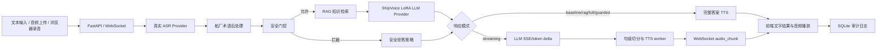

# ShipVoice 系统架构

## 总体链路



## 运行原则

ShipVoice 当前采用 real-only 策略。ASR、LLM、TTS 都必须连接真实 provider；任一服务不可用时，请求直接失败并写入审计日志。文本输入是独立 typed input，不被伪装成语音识别结果。音频上传和浏览器录音必须经过真实 ASR 服务转写。

安全门控位于 RAG 和 LLM 之前。危险、越界或提示注入请求被拦截后，不调用 LLM，也不为了演示效果继续调用 TTS 合成正文音频；系统返回规则化安全拒答文本并写入审计，体现 fail-closed 策略。

## 代码分层

| 层 | 文件 | 作用 |
|---|---|---|
| 配置 | `configs/pipeline.json`, `configs/runtime.real.env` | 真实 provider、延迟目标、术语和门控关键词 |
| 数据模型 | `src/shipvoice/models.py` | 事件、门控、检索结果、TTS 结果、指标结构 |
| Provider | `src/shipvoice/providers.py` | HTTP ASR、OpenAI-compatible ShipVoice LoRA LLM、HTTP TTS、RAG、安全门控 |
| Pipeline | `src/shipvoice/pipeline.py` | 串接 ASR、后处理、门控、检索、生成、合成和指标 |
| API | `src/shipvoice/fastapi_app.py` | `/api/run`、`/ws/run`、后台 API、健康检查 |
| 持久化 | `src/shipvoice/sqlite_store.py` | 知识库、运行审计、评测数据、case ledger |
| 前端 | `web/static/` | 用户端、浏览器录音、音频播放、运行详情 |
| 远端服务 | `remote/` | ASR、TTS、ShipVoice LoRA LLM 启停与训练脚本 |

## Provider 约定

ASR 使用 HTTP JSON：

```json
{
  "audio_base64": "...",
  "audio_name": "sample.wav"
}
```

响应读取 `text` 字段。

LLM 使用 OpenAI-compatible `/chat/completions` 接口。系统会把安全系统提示、历史对话和 RAG 证据一起传入模型。`streaming` mode 会设置 `stream=true` 并解析 OpenAI SSE delta；普通模式仍读取完整 response payload。

TTS 使用 HTTP JSON：

```json
{
  "text": "要播报的回答",
  "voice": "zh-CN-XiaoxiaoNeural"
}
```

响应读取 `audio_base64` 和 `mime_type` 字段。

## 流式低延迟链路

`streaming` mode 的目标是降低首段可播放延迟，而不是等待完整答案和完整 TTS 后一次返回。当前实现链路为：

1. LLM provider 以 `stream=true` 请求 OpenAI-compatible endpoint，并逐个读取 SSE token delta。
2. Pipeline 将 delta 累积为句子，句子结束后立即排入 TTS worker。
3. 每个 TTS 片段合成完成后，服务端通过 WebSocket 发送 `audio_chunk`，其中包含 `seq`、`mime_type`、`audio_base64` 和服务端 chunk ready 时间。
4. 前端收到首个 `audio_chunk` 后进入播放队列，并以浏览器 `audio.onplaying` 作为首播指标。

当前 TTS provider 仍按句返回完整音频片段，不是字节级连续 TTS；但 pipeline 已不再等待完整 LLM answer 才启动 TTS。

## 延迟测量点

当前系统同时保留服务端和浏览器端两类指标，避免用单一数字混淆不同测量点：

| 指标 | 测量点 | 使用场景 |
|---|---|---|
| `server_first_audio_chunk_ready_ms` | 服务端收到请求到首个流式音频片段 ready | baseline vs streaming 的同条件服务端对比 |
| `server_audio_stream_complete_ms` | 服务端收到请求到音频流全部完成 | 衡量完整回答完成时间 |
| `client_audio_onplaying_ms` | 浏览器提交请求到音频元素触发 `playing` | 答辩现场用户听到声音的时间 |
| `client_recording_stop_to_request_ms` | 浏览器停止录音到请求开始 | 识别录音整理和提交前等待 |
| `client_recording_stop_to_playing_ms` | 浏览器停止录音到首段音频真正播放 | 对齐题目建议的“用户端停止说话到首段音频开始播放” |

文本输入和文件上传路径不会伪造录音停止指标；只有浏览器直接录音产生的请求才会填充 `client_recording_stop_to_*` 字段。

## 可审计性

每次运行都会记录 `run_id`、`session_id`、输入方式、ASR/LLM/TTS provider、门控结果、证据标题、阶段耗时、回答摘要和错误信息。流式运行额外记录 `llm_first_delta_ms`、`server_first_audio_chunk_ready_ms`、`server_audio_stream_complete_ms` 和 `streamed_audio_segments`；浏览器端在音频真正播放时回写 `client_audio_onplaying_ms`，录音路径还会回写 `client_recording_stop_to_playing_ms`。后台可以查询、导出和复盘这些记录。
