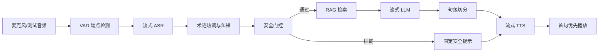

# 系统架构

## 总体流水线

## 当前代码分层

| 层 | 文件 | 作用 |
|---|---|---|
| 配置 | `configs/pipeline.json` | 延迟目标、术语、门控关键词 |
| 数据模型 | `src/shipvoice/models.py` | 事件、门控、检索、指标结构 |
| 配置加载 | `src/shipvoice/config.py` | 读取 JSON 配置 |
| Provider | `src/shipvoice/providers.py` | ASR/RAG/LLM/TTS/mock 实现 |
| 流水线 | `src/shipvoice/pipeline.py` | 串接各模块并产生日志事件 |
| 实验 | `scripts/run_benchmark.py` | 批量运行固定测试集并导出指标 |
| 面板 | `web/static/` | 答辩演示控制台 |

## 后续真实 Provider 替换点

当前 `providers.py` 中的 mock 类会被逐步替换：

- `MockASRProvider` -> `SenseVoiceProvider` 或 `FunASRProvider`
- `KeywordSafetyGate` -> `SafetyClassifierProvider`
- `SimpleRetriever` -> `VectorRetriever` 或混合检索
- `MockLLMProvider` -> `QwenStreamingProvider`
- `MockTTSProvider` -> `CosyVoiceProvider`

替换时保持 `pipeline.py` 的事件输出格式不变，这样前端面板和实验脚本无需重写。

