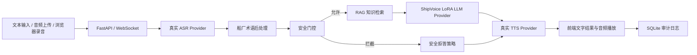

# ShipVoice 系统架构

## 总体链路



## 运行原则

ShipVoice 当前采用 real-only 策略。ASR、LLM、TTS 都必须连接真实 provider；任一服务不可用时，请求直接失败并写入审计日志。文本输入是独立 typed input，不被伪装成语音识别结果。音频上传和浏览器录音必须经过真实 ASR 服务转写。

安全门控位于 RAG 和 LLM 之前。危险、越界或提示注入请求被拦截后，不调用 LLM；系统只生成规则化安全拒答，并交给真实 TTS 播报。

## 代码分层

| 层 | 文件 | 作用 |
|---|---|---|
| 配置 | `configs/pipeline.json`, `configs/runtime.real.env` | 真实 provider、延迟目标、术语和门控关键词 |
| 数据模型 | `src/shipvoice/models.py` | 事件、门控、检索结果、TTS 结果、指标结构 |
| Provider | `src/shipvoice/providers.py` | HTTP ASR、OpenAI-compatible ShipVoice LoRA LLM、HTTP TTS、RAG、安全门控 |
| Pipeline | `src/shipvoice/pipeline.py` | 串接 ASR、后处理、门控、检索、生成、合成和指标 |
| API | `src/shipvoice/fastapi_app.py` | `/api/run`、`/ws/run`、后台 API、健康检查 |
| 持久化 | `src/shipvoice/sqlite_store.py` | 知识库、运行审计、评测数据、case ledger |
| 前端 | `web/static/` | 用户端、浏览器录音、音频播放、运行详情 |
| 远端服务 | `remote/` | ASR、TTS、ShipVoice LoRA LLM 启停与训练脚本 |

## Provider 约定

ASR 使用 HTTP JSON：

```json
{
  "audio_base64": "...",
  "audio_name": "sample.wav",
  "transcript_hint": "可选文本提示"
}
```

响应读取 `text` 字段。

LLM 使用 OpenAI-compatible `/chat/completions` 接口。系统会把安全系统提示、历史对话和 RAG 证据一起传入模型。

TTS 使用 HTTP JSON：

```json
{
  "text": "要播报的回答",
  "voice": "zh-CN-XiaoxiaoNeural"
}
```

响应读取 `audio_base64` 和 `mime_type` 字段。

## 可审计性

每次运行都会记录 `run_id`、`session_id`、输入方式、ASR/LLM/TTS provider、门控结果、证据标题、阶段耗时、回答摘要和错误信息。后台可以查询、导出和复盘这些记录。
